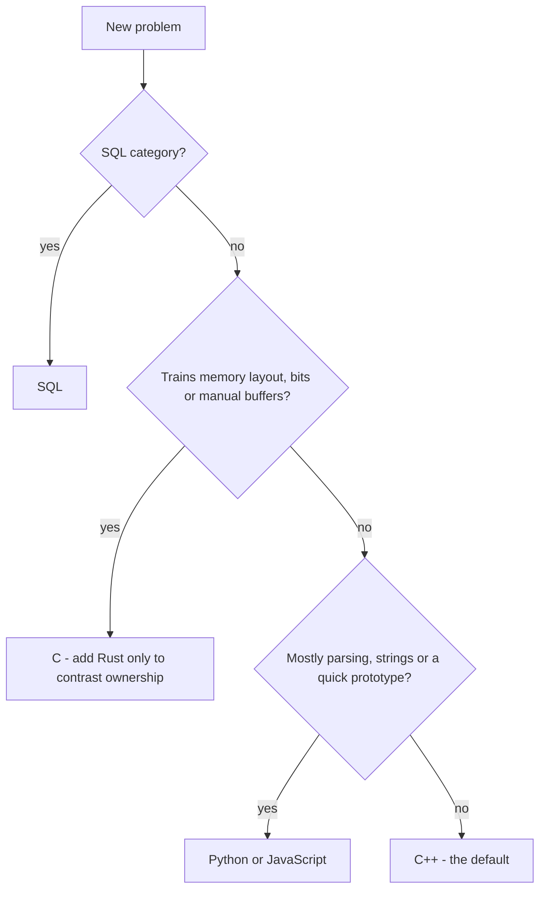

# Language Policy

This repository supports six languages: **C++, C, Python, JavaScript, Rust, and SQL**.

Supporting many languages does not mean solving every problem in all of them. Rewriting the same solution five times adds repetition, not evidence of reasoning. The rule is simple:

> **Each problem has one primary language, chosen for what the problem trains.**

## Choosing the primary language

| Language | Choose it when the problem is mostly about... |
|----------|-----------------------------------------------|
| **C++** (default) | data structures, graphs, paradigms, mathematics, anything that benefits from the standard library and predictable performance |
| **C** | bit manipulation, memory layout, manual buffers, C-style strings and input parsing |
| **Rust** | ownership, lifetimes, and memory safety as the point of the exercise; the natural counterpart to C |
| **Python** | strings, ad-hoc simulation, big integers, quick prototypes |
| **JavaScript** | parsing and text processing close to my professional stack |
| **SQL** | the SQL category, and only the SQL category |

Any problem that does not use C++ states the reason in one line of its `README.md`, so the variety is visibly intentional.

## Additional implementations

`Other Implementations` stays empty by default. A second implementation is added only when it teaches something specific:

- a **C versus Rust** comparison of manual memory management and ownership;
- a short **Python oracle** (brute force) used to cross-check a faster solution;
- a deliberate exercise in the idioms of another language.

The reason is written in the problem `README.md`. Documentation stays centralized: one explanation file per problem.

## Status integrity

`Status: Solved` is only valid for code that was **submitted to the judge and accepted**.

- When migrating a legacy solution, keep the language in which it was accepted.
- Rewriting a solution in another language is a new submission and has its own status.
- Use `In Progress`, `Improving`, or `To Review` until the judge confirms the result.

## Open points

- Judge support for **Rust** is not confirmed. Until it is, Rust solutions are local study material and are never marked `Solved`.
- The **SQL** engine used by the judge, and a local SQL test runner, are still to be defined.

## How the policy is enforced

`scripts/validate_structure.py` rejects unsupported language folders, empty solution files, a primary language without code, SQL outside the SQL category, and a `Solved` status without test cases. See [Testing](testing.md).
